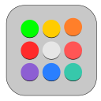
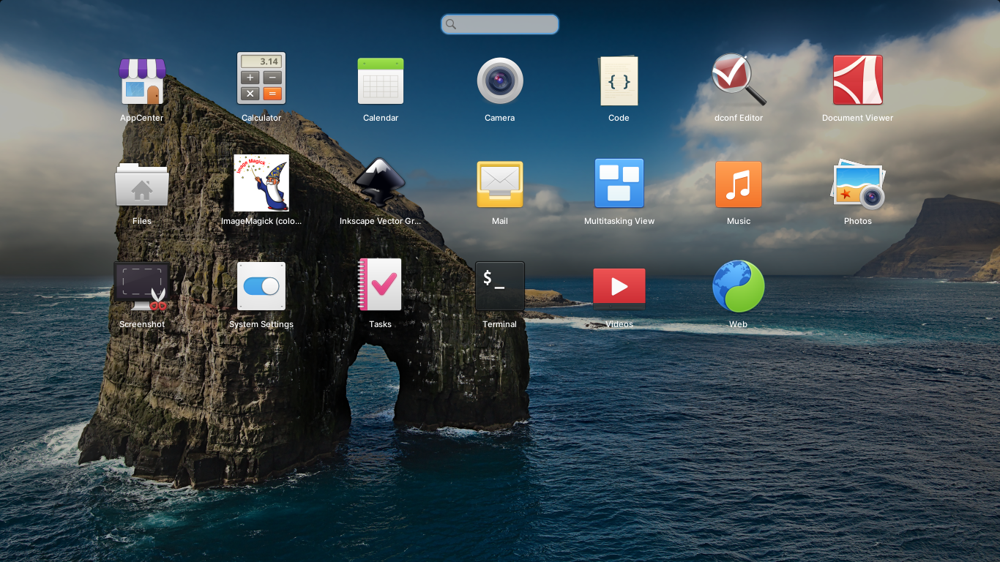
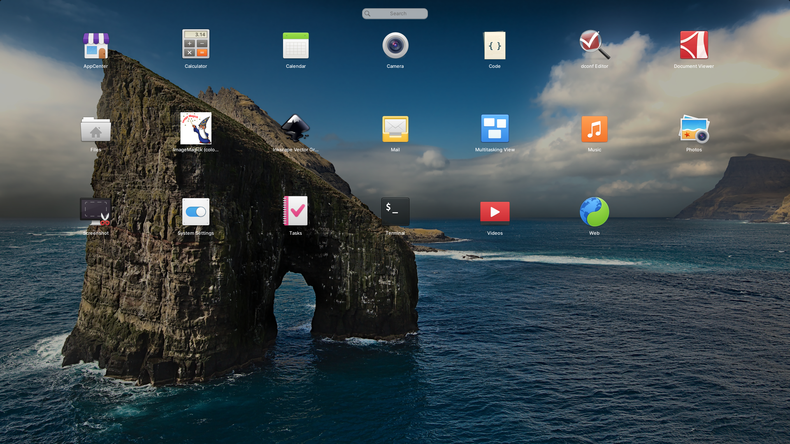
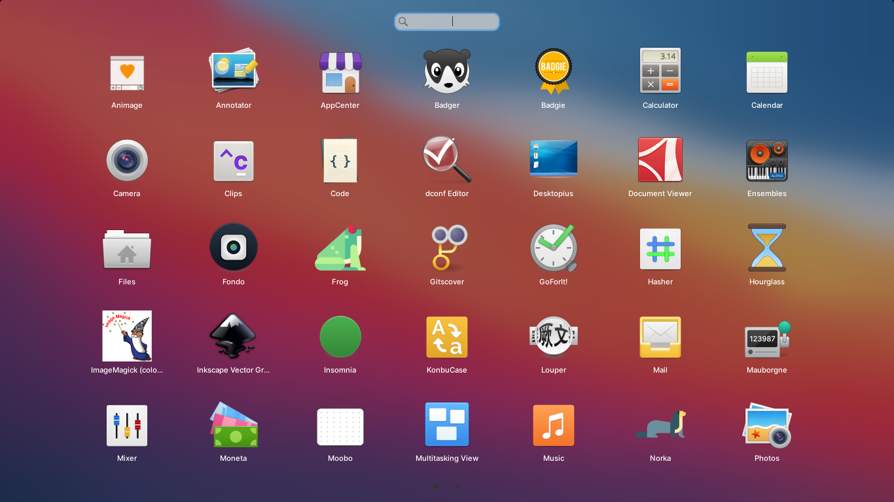
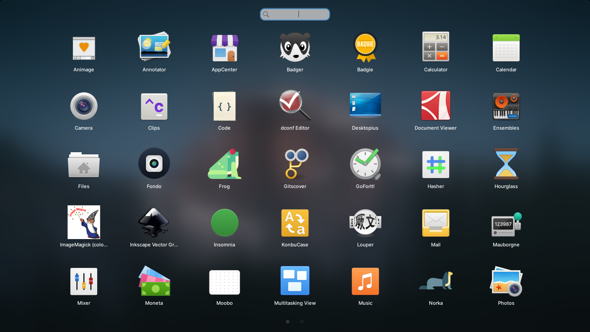

# AppsView
A beautiful fullscreen application launcher for elementary OS

Using elementary applications-menu codebase

<p align="center">

<br>
Updated with blur:


Previous version:


</p>

# Install it from source

You can of course download and install this app from source.

## Dependencies

Ensure you have these dependencies installed

* granite
* gtk+-3.0
* libsoup2.4-dev
* libappstream-dev
* libgee-0.8-dev
* libgnome-menu-3-dev
* libgranite-dev >= 6.1.0
* libgtk-3-dev
* libhandy-1-dev >= 0.83.0
* libjson-glib-dev
* libplank-dev
* libsoup2.4-dev
* libzeitgeist-2.0-dev
* libwebkit2gtk-4.0-dev
* liblightdm-gobject-1-dev
* meson
* pkg-config
* valac


## Install, build and run

```bash
# install elementary-sdk, meson and ninja
sudo apt install elementary-sdk
# clone repository
git clone https://github.com/netusMX/AppsView AppsView
# cd to dir
cd AppsView
# run meson
meson build --prefix=/usr
# cd to build, build and test
cd build
sudo ninja install
